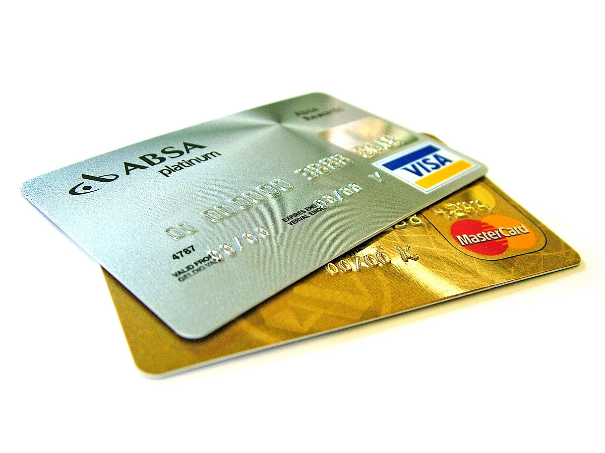
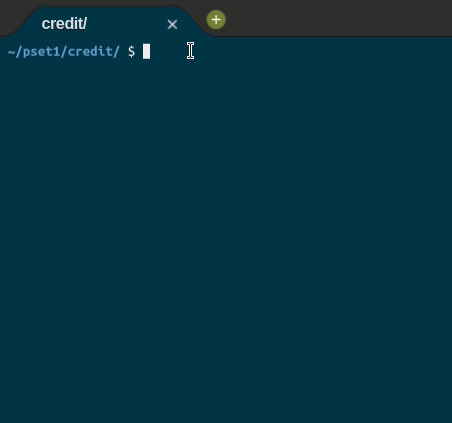

	
		

	<h1>Credit 💳</h1>	

	
	<a href="https://cs50.harvard.edu/x/2020/psets/1/mario/more/">See it on CS50x page</a>
	<a href="https://github.com/felipejsborges/cs50_challenges#cs50x-challenges-">Back to all projects</a>

### What is? 🤔
A [program](./credit.c) that gets a **card number** and returns **MASTER, VISA, AMEX or INVALID** on console. To verify if the number is valid, an **algorithm** invented by Hans Peter Luhn of IBM is used. According to [Luhn’s algorithm](https://www.geeksforgeeks.org/luhn-algorithm/), you can **determine if a credit card number is valid** as follows:
- Multiply every other digit by 2, starting with the number’s second-to-last digit, and then add those products’ digits together;
- Add the sum to the sum of the digits that weren’t multiplied by 2;
- If the total’s last digit is 0 (or, put more formally, if the total modulo 10 is congruent to 0), the number is valid.

And how we can define the **credit card operator**?
- American Express uses 15-digit numbers and starts with 34 or 37
- MasterCard uses 16-digit numbers and starts with 51, 52, 53, 54, or 55
- Visa uses 13- and 16-digit numbers and starts with 4.

### Which technologies were used? 💻
- C language

### Look at the final result 📺 

by Felipe Borges 
[LinkedIn](https://www.linkedin.com/in/felipejsborges) | [GitHub](https://github.com/felipejsborges)
