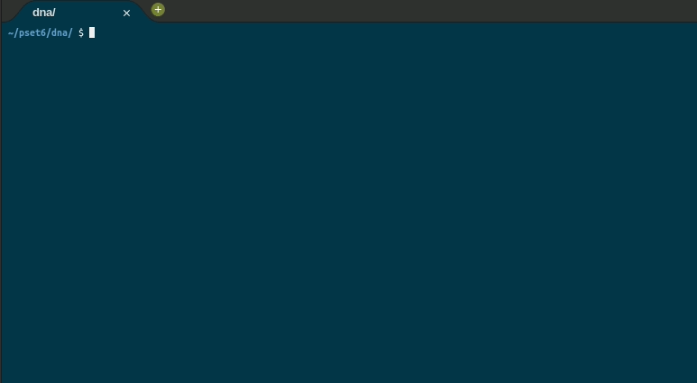

	
		

	<h1>DNA 🧬</h1>	

	<a href="https://cs50.harvard.edu/x/2020/psets/6/dna/">See it on CS50x page</a> |
	<a href="https://github.com/felipejsborges/cs50_challenges#cs50x-challenges-">Back to all projects</a>

### What is? 🤔
A [program](./dna.py) that look for a DNA of a specific person in a database.

### Which technologies were used? 💻
- Python

### Look at the final result 📺 

by Felipe Borges 
[LinkedIn](https://www.linkedin.com/in/felipejsborges) | [GitHub](https://github.com/felipejsborges)
