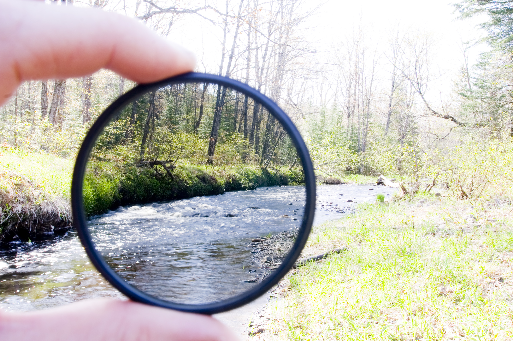
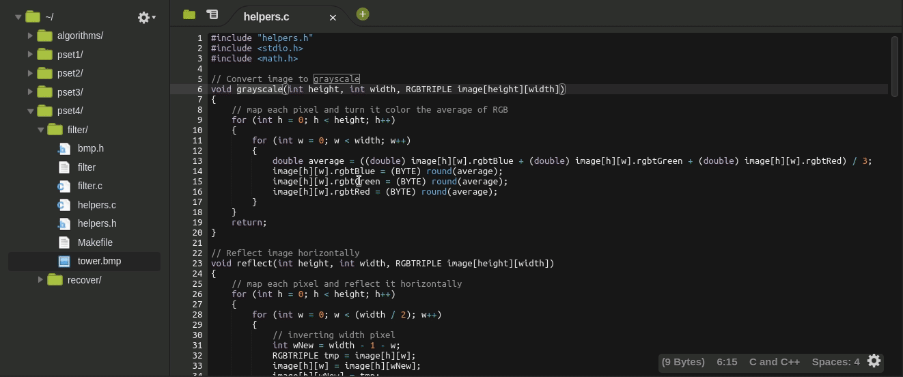
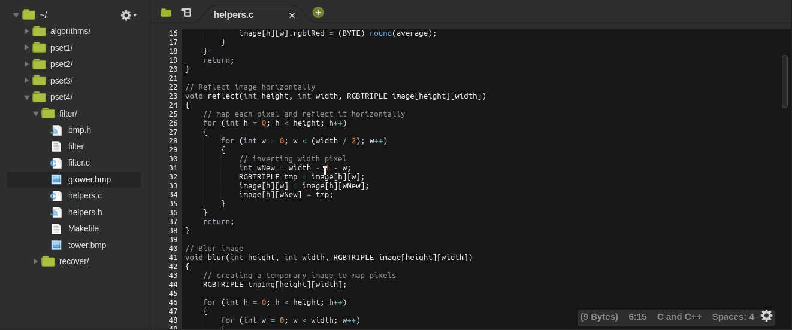
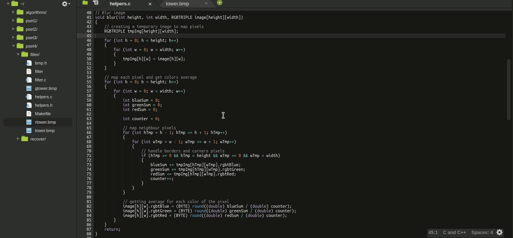
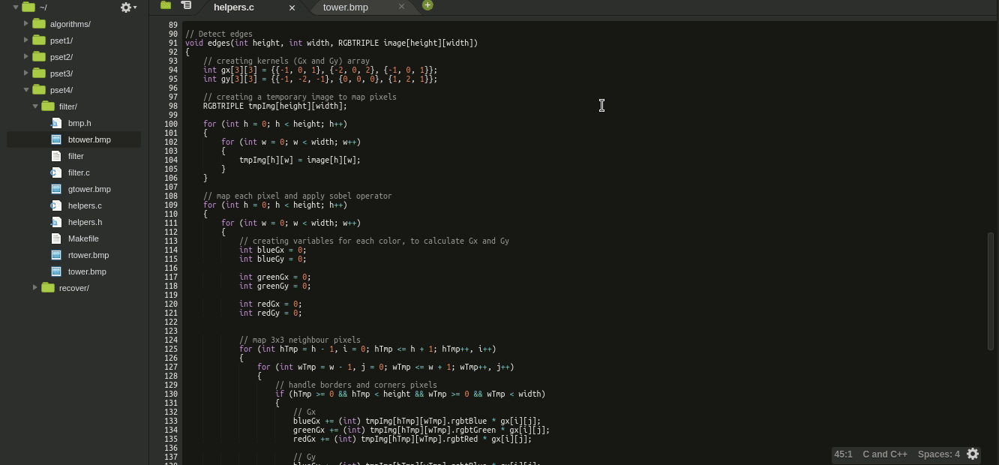
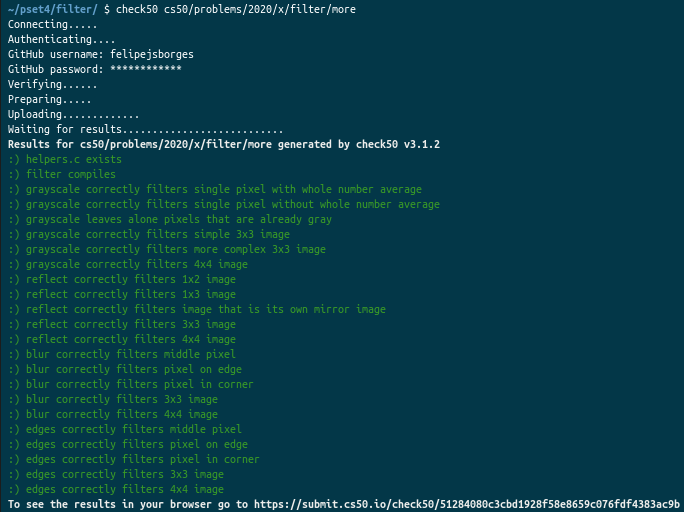

	
		

	<h1>Filter 📷</h1>	

  <a href="https://cs50.harvard.edu/x/2020/psets/4/filter/more/">See it on CS50x page</a> |
	<a href="https://github.com/felipejsborges/cs50_challenges#cs50x-challenges-">Back to all projects</a>  

### What is? 🤔
A [program](./helpers.c) that a user can apply grayscale, reflection, blur, or edge detection **filters to their images**.

### How I had to create this program? ✅

Implementing in helpers.c:

- The grayscale function should take an image and turn it into a black-and-white version of the same image.
- The reflect function should take an image and reflect it horizontally.
- The blur function should take an image and turn it into a box-blurred version of the same image.
- The edges function should take an image and highlight the edges between objects, according to the Sobel operator.

### Which technologies were used? 💻
- C language

### Look at the final result 📺 
**Grayscale**

**Reflect**

**Blur**

**Edges**

### Tests ✅ 

by Felipe Borges 
[LinkedIn](https://www.linkedin.com/in/felipejsborges) | [GitHub](https://github.com/felipejsborges)
