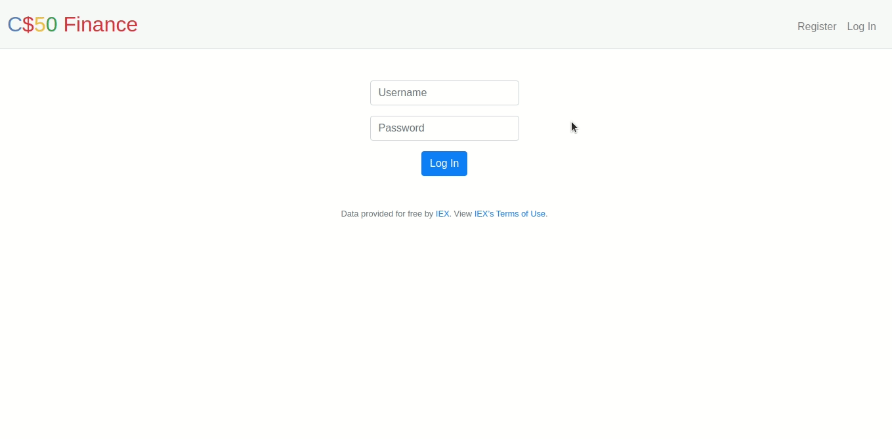
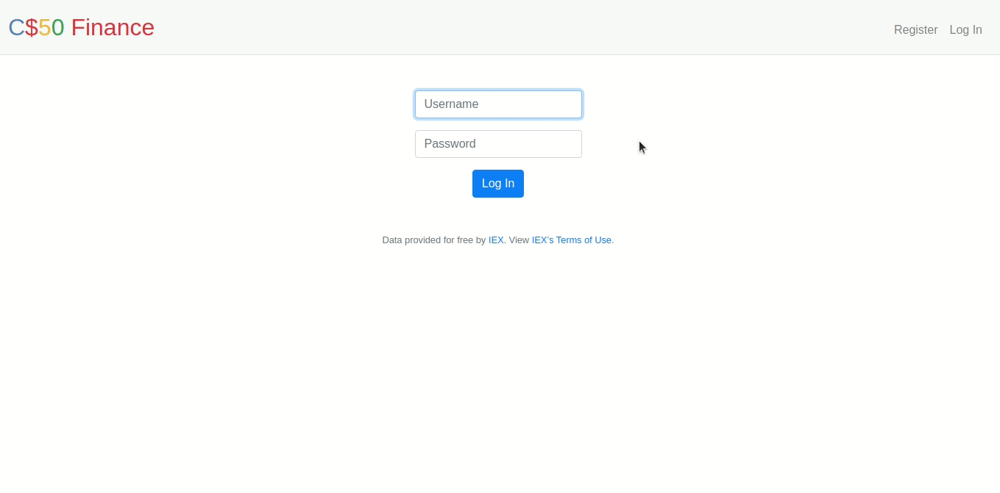
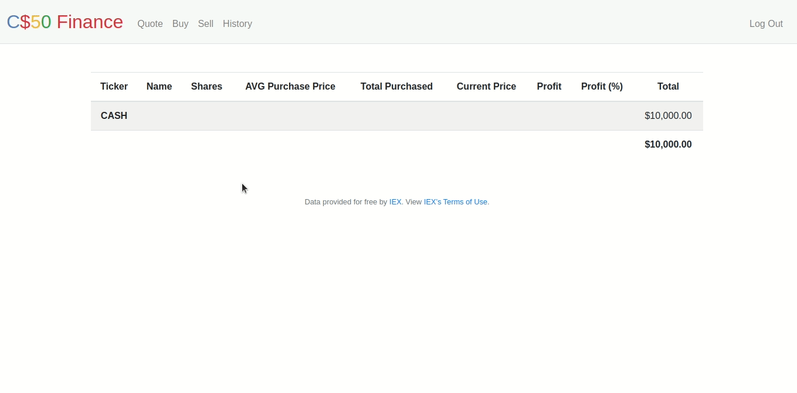
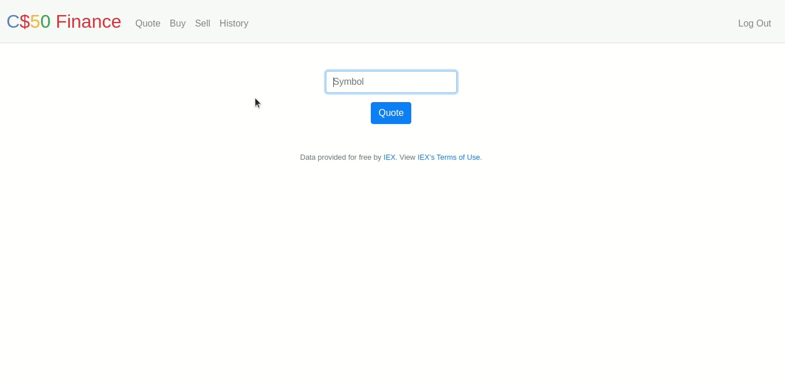
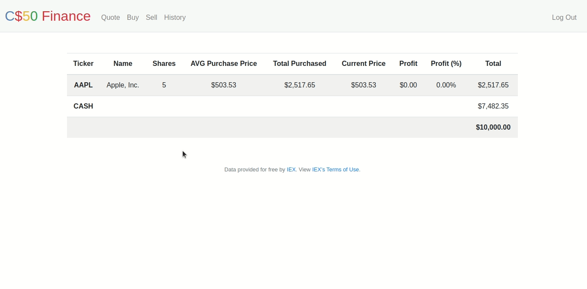
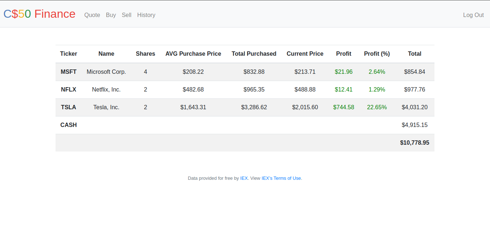

	
		

	<h1>Finance 📈</h1>	

	<a href="https://cs50.harvard.edu/x/2020/tracks/web/finance/">See it on CS50x page</a> |
	<a href="https://github.com/felipejsborges/cs50_challenges#cs50x-challenges-">Back to all projects</a>

### What is? 🤔
A website that simulates an investment portfolio. Users can manage their stocks: quote, buy, sell, and analyze their results. This project uses real stocks’ actual prices by querying [IEX for stocks’ prices](https://iextrading.com/apps/stocks/). They let us download stock data (in JSON) via [their API](https://iexcloud.io/docs/api/).

### Which technologies were used? 💻
- HTML
- CSS (+ Bootstrap)
- JavaScript
- Flask (Python)

### Features ✅ 

	<h4>Register</h4>
	

	<h4>Login</h4>
	

	<h4>Quote</h4>
	

	<h4>Buy</h4>
	

	<h4>Sell</h4>
	

	<h4>Index</h4>
	

	<h4>Logout</h4>
	

by Felipe Borges 
[LinkedIn](https://www.linkedin.com/in/felipejsborges) | [GitHub](https://github.com/felipejsborges)
