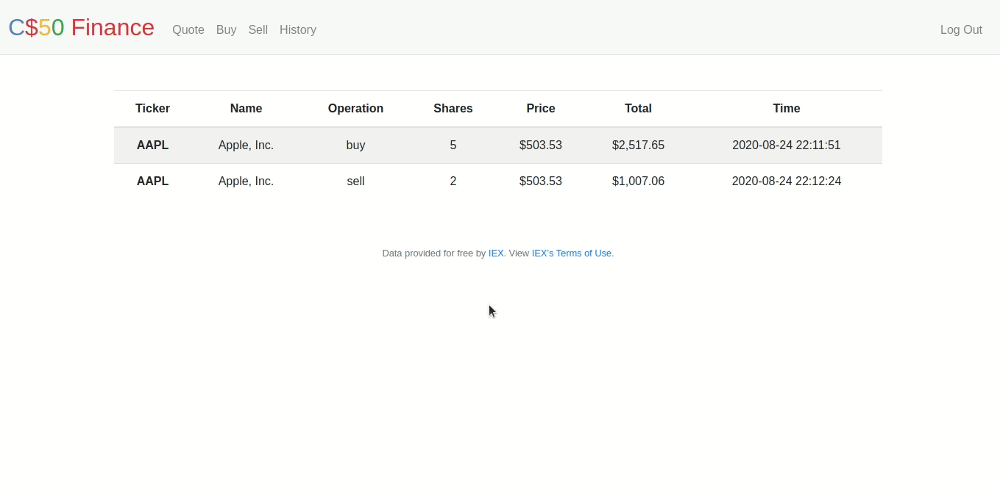

<div align="center">	
		
</div>

<div align="center">
	<h1>Finance 📈</h1>	
</div>

<div align="center">
	<a href="https://cs50.harvard.edu/x/2020/tracks/web/finance/">See it on CS50x page</a> |
	<a href="https://github.com/felipejsborges/cs50_challenges#cs50x-challenges-">Back to all projects</a>
</div>

### What is? 🤔
A website that simulates an investment portfolio. Users can manage their stocks: quote, buy, sell, and analyze their results. This project uses real stocks’ actual prices by querying [IEX for stocks’ prices](https://iextrading.com/apps/stocks/). They let us download stock data (in JSON) via [their API](https://iexcloud.io/docs/api/).<br>
<div align="center">
	<h4>See how it looks</h4>
	
</div>
<hr>

### Which technologies were used? 💻
- HTML
- CSS (+ Bootstrap)
- JavaScript
- Flask (Python)
<hr>

### Features ✅<br>
<div align="center" style="border: solid 1px;">
	<h4>Register</h4>
	
</div>
<hr>
<div align="center" style="border: solid 1px;">
	<h4>Login</h4>
	
</div>
<hr>
<div align="center" style="border: solid 1px;">
	<h4>Quote</h4>
	
</div>
<hr>
<div align="center" style="border: solid 1px;">
	<h4>Buy</h4>
	
</div>
<hr>
<div align="center" style="border: solid 1px;">
	<h4>Sell</h4>
	
</div>
<hr>
<div align="center" style="border: solid 1px;">
	<h4>Index</h4>
	
</div>
<hr>
<div align="center" style="border: solid 1px;">
	<h4>History</h4>
	
</div>
<hr>
<div align="center" style="border: solid 1px;">
	<h4>Logout</h4>
	
</div>
<hr>

### How to run this application ▶️<br>

At first, you have to register for an API key:

- [Click here](https://iexcloud.io/cloud-login#/register/) and create an account
- Choose the Start (free) plan.
- Confirm your account via email, and [sign in to iexcloud.io](https://iexcloud.io/cloud-login).
- Click on API Tokens.
- Copy the key that appears under the Token column (it should begin with pk_) and save it to be used later.
<br>

Now:

- Clone [this repo](https://github.com/felipejsborges/cs50_challenges)
```bash
$ git clone https://github.com/felipejsborges/cs50_challenges.git
```

- Go to Finance folder
```bash
$ cd cs50_challenges/finance
```

- Export API key
```bash
$ export API_KEY=<copied key>
```

- Run flask project ([click here](https://flask.palletsprojects.com/en/1.1.x/quickstart/) if you need help with that)
```bash
$ export FLASK_APP=application.py
$ flask run
```

- Visit the URL outputted by flask to see the Finance Website in action.
<hr>

by Felipe Borges<br>
[LinkedIn](https://www.linkedin.com/in/felipejsborges) | [GitHub](https://github.com/felipejsborges)
