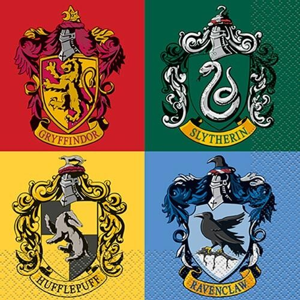

	
		

	<h1>Houses 🏠</h1>	

	<a href="https://cs50.harvard.edu/x/2020/psets/7/houses/">See it on CS50x page</a> |
	<a href="https://github.com/felipejsborges/cs50_challenges#cs50x-challenges-">Back to all projects</a>

### What is? 🤔
A [program](./import.py) to read data of .csv file and save it to a .sql database. And [another](./roster.py) that gets this data and show to the user.

### Which technologies were used? 💻
- Python and SQL

### Look at the final result 📺 

 

by Felipe Borges 
[LinkedIn](https://www.linkedin.com/in/felipejsborges) | [GitHub](https://github.com/felipejsborges)
