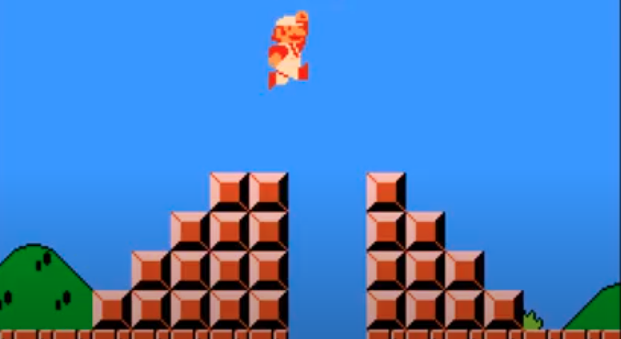
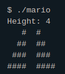

	
		

	<h1>Mario 🍄</h1>	

	
	<a href="https://github.com/felipejsborges/cs50_challenges">Back to all projects</a>

### What is? 🤔
A program that receives a height of a stair and returns it on console. For example:
	

### Which technologies were used? 💻
- C language

### Look the final result 📺
 

by Felipe Borges 
[LinkedIn](https://www.linkedin.com/in/felipejsborges) | [GitHub](https://github.com/felipejsborges)
