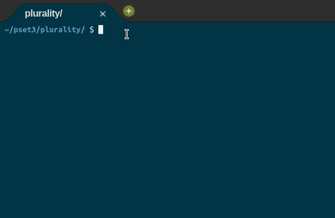

	
		

	<h1>Plurality 🗳️</h1>	

	
	<a href="https://github.com/felipejsborges/cs50_challenges#cs50x-challenges-">Back to all projects</a>

### What is? 🤔
A [program](./substitution.c) that runs a plurality election. The candidates names must be inserted as a command-line argument. The function should print out the name of the candidate who received the most votes in the election. It is possible that the election could end in a tie if multiple candidates each have the maximum number of votes. In that case, the program output the names of each of the winning candidates.

### Which technologies were used? 💻
- C language

### Look at the final result 📺 

by Felipe Borges 
[LinkedIn](https://www.linkedin.com/in/felipejsborges) | [GitHub](https://github.com/felipejsborges)
