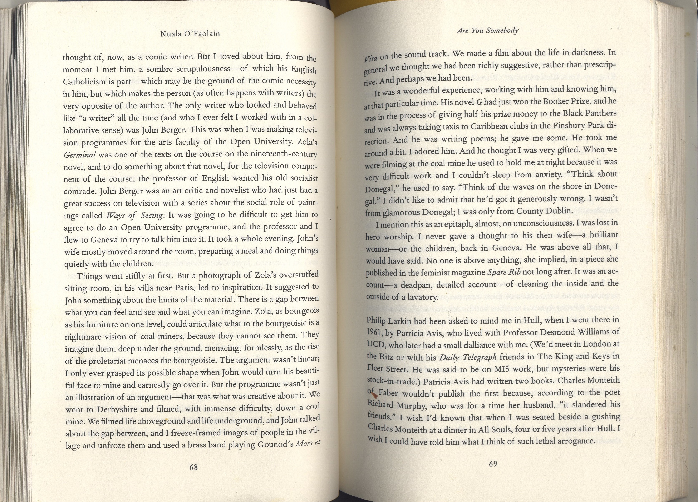
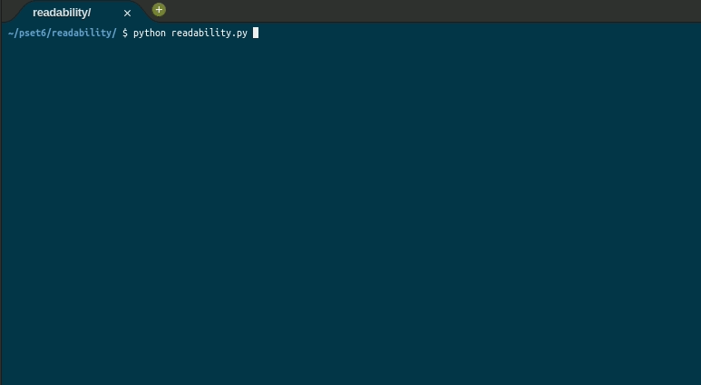

	
		

	<h1>Readability 📖</h1>	

	<a href="https://cs50.harvard.edu/x/2020/psets/6/readability/">See it on CS50x page</a> |
	<a href="https://github.com/felipejsborges/cs50_challenges#cs50x-challenges-">Back to all projects</a>

### What is? 🤔
A [program](./readability.py) that gets a text and returns the grade reading level. It can be "Before grade 1", from grade 1 to 16 and higher then grade 16. It was developed before using C language. [Click here to see!](https://github.com/felipejsborges/cs50_challenges/tree/master/readability)

### Which technologies were used? 💻
- Python

### Look at the final result 📺 

by Felipe Borges 
[LinkedIn](https://www.linkedin.com/in/felipejsborges) | [GitHub](https://github.com/felipejsborges)
