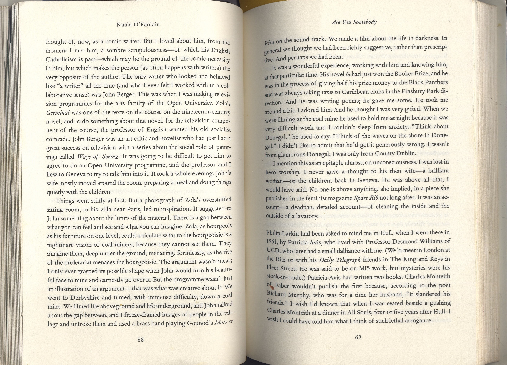
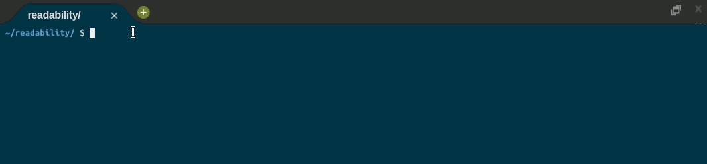

	
		

	<h1>Readability 📖</h1>	

	<a href="https://cs50.harvard.edu/x/2020/psets/2/readability/">See it on CS50x page</a> |
	<a href="https://github.com/felipejsborges/cs50_challenges#cs50x-challenges-">Back to all projects</a>

### What is? 🤔
A [program](./readability.c) that gets a text and returns the grade reading level. It can be "Before grade 1", from grade 1 to 16 and higher then grade 16. How do we test the reading level of a text? One such readability test is the [Coleman-Liau index](https://readabilityformulas.com/coleman-liau-readability-formula.php). The Coleman-Liau index of a text is designed to output what (U.S.) grade level is needed to understand the text. The formula is:

- `index = 0.0588 * L - 0.296 * S - 15.8`. Here, L is the average number of letters per 100 words in the text, and S is the average number of sentences per 100 words in the text.

### Which technologies were used? 💻
- C language

### Look at the final result 📺 

by Felipe Borges 
[LinkedIn](https://www.linkedin.com/in/felipejsborges) | [GitHub](https://github.com/felipejsborges)
