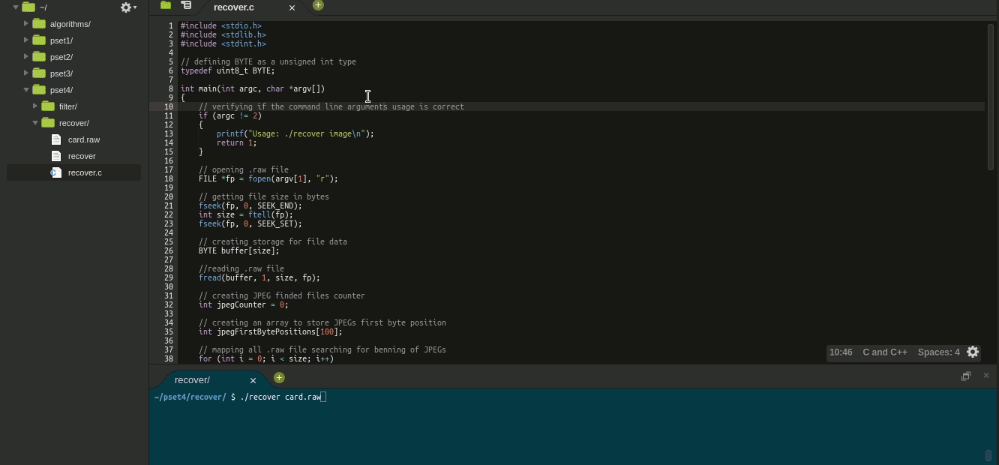
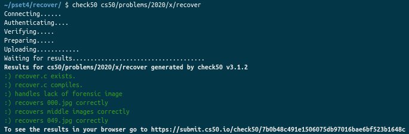

	
		

	<h1>Recover 💽</h1>	

  <a href="https://cs50.harvard.edu/x/2020/psets/4/recover/">See it on CS50x page</a> |
	<a href="https://github.com/felipejsborges/cs50_challenges#cs50x-challenges-">Back to all projects</a>  

### What is? 🤔
A [program](./recover.c) to **recover** deleted **images**.

### What does this program do? ✅

- Accept exactly one command-line argument, the name of a forensic image from which to recover JPEGs, and remind the user of correct usage ( Usage: ./recover image ), and main should return 1.

- Recover every one of the JPEGs from a .raw file, storing each as a separate file in current working directory. To do that, we had to look at the first four bytes of every block of the original file and see if it contains jpeg headers.

- Number the files it outputs by naming each ###.jpg, where ### is three-digit decimal number from 000 on up.

### Which technologies were used? 💻
- C language

### Look at the final result 📺 

### Tests ✅ 

by Felipe Borges 
[LinkedIn](https://www.linkedin.com/in/felipejsborges) | [GitHub](https://github.com/felipejsborges)
