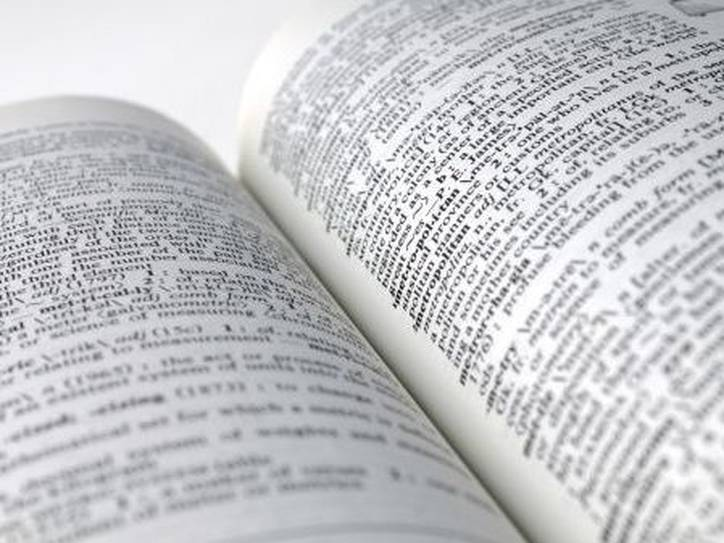
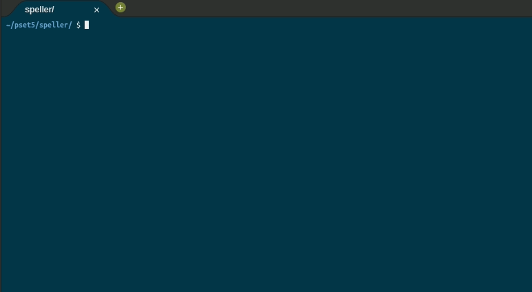
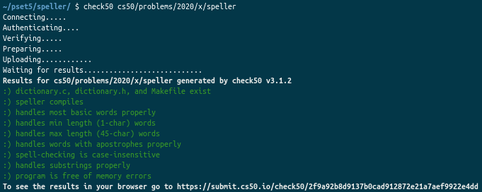

	
		

	<h1>Speller 📙</h1>

  <a href="https://cs50.harvard.edu/x/2020/psets/5/speller/">See it on CS50x page</a> |
	<a href="https://github.com/felipejsborges/cs50_challenges#cs50x-challenges-">Back to all projects</a>  

### What is? 🤔
A [program](./dictionary.c) that **spell-checks** a file.

### What does this program do? ✅

- Load a dictionary, storing words on a hash table

- Read a text (or book)

- Count it size

- Check each word if it is misspelled

- Unload the dictionary

### Which technologies were used? 💻
- C language

### Look at the final result 📺 

### Tests ✅ 

by Felipe Borges 
[LinkedIn](https://www.linkedin.com/in/felipejsborges) | [GitHub](https://github.com/felipejsborges)
