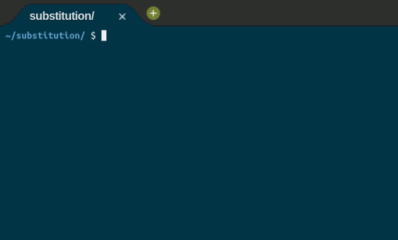

<div align="center">	
		
</div>

<div align="center">
	<h1>Substitution 🔑</h1>	
</div>

<div align="center">	
	<a href="https://github.com/felipejsborges/cs50_challenges#cs50x-challenges-">Back to all projects</a>
</div>

### What is? 🤔
A [program](./substitution.c) that implements a **substitution cipher**: "encrypt” a message by replacing every letter with another letter. To do so, we use a **key**: in this case, a **mapping of each of the letters of the alphabet to the letter it should correspond to when we encrypt** it. For example, the string VCHPRZGJNTLSKFBDQWAXEUYMOI. This 26-character key means that A should be converted into V, B should be converted into C, and so forth. At the time the user executes the program, they should decide, **by providing a command-line argument, on what the key should be in the secret message they’ll provide at runtime**.
<br>

**Rules**
- Only substitute alphabetical characters
- Lowercase letters remain lowercase, and uppercase letters remain uppercase.
- Whether the characters in the key itself are uppercase or lowercase doesn’t matter. A key of VCHPRZGJNTLSKFBDQWAXEUYMOI is functionally identical to a key of vchprzgjntlskfbdqwaxeuymoi or VcHpRzGjNtLsKfBdQwAxEuYmOi.
<br>

**Example**
```
$ ./substitution VCHPRZGJNTLSKFBDQWAXEUYMOI
plaintext:  hello, world
ciphertext: jrssb, ybwsp
```
<hr>

### Which technologies were used? 💻
- C language
<hr>

### Look at the final result 📺<br>

<hr>

by Felipe Borges<br>
[LinkedIn](https://www.linkedin.com/in/felipejsborges) | [GitHub](https://github.com/felipejsborges)
