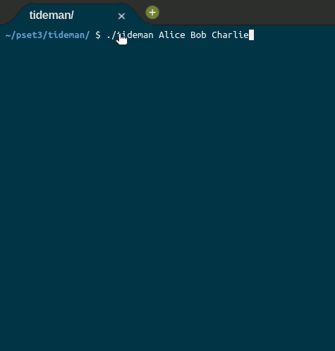

	
		

	<h1>Tideman 🗳️</h1>	

  <a href="https://cs50.harvard.edu/x/2020/psets/3/tideman/">See it on CS50x page</a> |
	<a href="https://github.com/felipejsborges/cs50_challenges#cs50x-challenges-">Back to all projects</a>  

### What is? 🤔
A [program](./tideman.c) to run a ranked-choice voting system. Each voter specify their first to ith preference candidate, creating a candidate rank array. In this array, the first candidate wins a head-to-head matchup against second, third, ..., and ith candidate. The second candidate wins against third, fourth, ..., and ith, and so forth.

### Who wins? 🏆
A “graph” of candidates is constructed, where an arrow from candidate A to candidate B indicates that candidate A wins against candidate B in a head-to-head matchup. The winner of the election should be the “source” of the graph, the candidate that has no arrow pointing at them.

	

In the image below, Alice is the winner.

It’s possible, however, that when the arrows are drawn, there is no winner.

	

 

To handle this, the Tideman algorithm specifies that matchup edges should be “locked in” to the graph one at a time, based on the “strength” of the victory (the more people who prefer a candidate over their opponent, the stronger the victory). So long as the edge can be locked into the graph without creating a cycle, the edge is added; otherwise, the edge is ignored.

### Overview 📄

- Once all of the voters have indicated all of their preferences, determine, for each pair of candidates, who the preferred candidate is and by what margin they are preferred.

- Sort the pairs of candidates in decreasing order of strength of victory, where strength of victory is defined to be the number of voters who prefer the preferred candidate.

- Starting with the strongest pair, go through the pairs of candidates in order and “lock in” each pair to the candidate graph, so long as locking in that pair does not create a cycle in the graph.
	
Once the graph is complete, the source of the graph is the winner!

### What does the program need to do? ✅

** create `vote` function **
- The function takes arguments rank, name, and ranks. If name is a match for the name of a valid candidate, then you should update the ranks array to indicate that the voter has the candidate as their rank preference (where 0 is the first preference, 1 is the second preference, etc.)

- Recall that ranks[i] here represents the user’s ith preference.
	
- The function should return true if the rank was successfully recorded, and false otherwise (if, for instance, name is not the name of one of the candidates).
	
- You may assume that no two candidates will have the same name. 

** Create `record_preferences` function **
- The function is called once for each voter, and takes as argument the ranks array, (recall that ranks[i] is the voter’s ith preference, where ranks[0] is the first preference).

- The function should update the global preferences array to add the current voter’s preferences. Recall that preferences[i][j] should represent the number of voters who prefer candidate i over candidate j.

- You may assume that every voter will rank each of the candidates. 

** Create `add_pairs` function **
- The function should add all pairs of candidates where one candidate is preferred to the pairs array. A pair of candidates who are tied (one is not preferred over the other) should not be added to the array.

- The function should update the global variable pair_count to be the number of pairs of candidates. (The pairs should thus all be stored between pairs[0] and pairs[pair_count - 1], inclusive). 

** Create `sort_pairs` function **
- The function should sort the pairs array in decreasing order of strength of victory, where strength of victory is defined to be the number of voters who prefer the preferred candidate. If multiple pairs have the same strength of victory, you may assume that the order does not matter. 

** Create `lock_pairs` function **
- The function should create the locked graph, adding all edges in decreasing order of victory strength so long as the edge would not create a cycle. 

** Create `print_winner` function **
- The function should print out the name of the candidate who is the source of the graph. You may assume there will not be more than one source.

### Which technologies were used? 💻
- C language

### Look at the final result 📺 

by Felipe Borges 
[LinkedIn](https://www.linkedin.com/in/felipejsborges) | [GitHub](https://github.com/felipejsborges)
